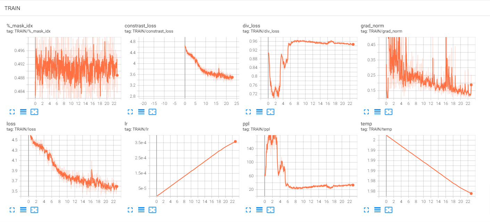

# PRETRAINING WAV2VEC 2.0 ON YOUR OWN DATASETS
<a name = "documentation" ></a>
### Documentation
Now you can pre-train Wav2vec 2.0 model on your dataset, push it into the Huggingface hub, and finetune it on downstream tasks with just a few lines of code. Follow the below instruction on how to use it.

### Supporting features include:
- [x] Train on your own local datasets.
- [x] Visualization with Tensorboard.
- [x] Resume training (optimizer, a learning rate scheduler, gradient scaler,...) from the latest checkpoint.
- [x] No data caching. Data is loaded on the fly (no disk memory consuming).
- [x] Checkpoint is saved separately at each epoch.

<a name = "installation" ></a>
### Installation
```
pip install -r requirements.txt
```

<a name = "usage" ></a>
### Usage
1. Prepare your dataset:
    - Your dataset can be in <b>.txt</b> or <b>.csv</b> format.
    - Only <b>PATH</b> column is compulsory, the others (eg: DURATION, TRANSCRIPT, ...) are not necessary. <b>PATH</b> contains the paths to your stored audio files. Depending on your dataset location, it can be either absolute paths or relative paths. 
    - If <b>DURATION</b> column is not provided, all audio will be used. Audio length should be at least <b>0.5s</b>.
    - Check out our [data_example.csv](examples/data_example.csv) file for more information.

2. Run: I strongly recommend running ```python run.py --help``` to understand the arguments before training.
    - Train:
        ```
        CUDA_VISIBLE_DEVICES="0" accelerate launch \
            --multi_gpu \
            --num_machines="1" \
            --num_processes="1" \
            --mixed_precision="fp16" \
            --num_cpu_threads_per_process="12" \
            run_wav2vec2_pretraining_no_trainer.py \
                --train_datasets \ 
                    data/train_clean_100.tsv \
                    data/train_clean_360.tsv \
                    data/train_other_500.tsv \
                --val_datasets \
                    data/dev_clean.tsv \
                    data/dev_other.tsv \
                --audio_column_name="path" \
                --duration_column_name="duration" \
                --separator="\t" \
                --model_name_or_path="facebook/wav2vec2-base" \
                --load_from_pretrained \
                --output_dir="wav2vec2_pretraining" \
                --max_train_steps="200000" \
                --num_warmup_steps="32000" \
                --gradient_accumulation_steps="8" \
                --learning_rate="0.005" \
                --weight_decay="0.01" \
                --max_duration_in_seconds="15.6" \
                --min_duration_in_seconds="0.5" \
                --logging_steps="1" \
                --saving_steps="100" \
                --per_device_train_batch_size="16" \
                --per_device_eval_batch_size="8" \
                --gradient_checkpointing
        ```
    - Resume: Same as Train, but with an additional argument
        ```
        --resume
        ```
3. Tips for training: Some good metrics to guarantee your pretraining process is running right: <b>contrast_loss</b> and <b>cosine_sim</b>. Usually, the <b>contrastive loss should be below 2.0</b>, and <b>cosine_sim should be higher than 50%</b>. 

4. How to use your pre-trained model: 
    - I load my pre-trained model checkpoint from epoch 10 and get the last hidden state embedding:
        ```
        from transformers import Wav2Vec2Processor, Wav2Vec2Model
        import torch
        import librosa

        # load audio
        wav, sr = librosa.load(<audio_path>, sr=16000)

        # load pretrained
        feature_extractor = Wav2Vec2FeatureExtractor.from_pretrained("<output_dir>/saved_model/epoch_10")
        model = Wav2Vec2Model.from_pretrained("<output_dir>/saved_model/epoch_10")

        # run forward pass
        inputs = feature_extractor(wav, sampling_rate=sr, return_tensors="pt")
        with torch.no_grad():
            outputs = model(**inputs)

        last_hidden_state = outputs.last_hidden_state
        print(last_hidden_state.shape)
        ```
    - Finetune for ASR task: Check out this [REPO](https://github.com/khanld/ASR-Wav2vec-Finetune) for finetuning Wav2vec 2.0 for Automatic Speech Recognition using Connectionist Temporal Classification.

<a name = "logs" ></a>
### Logs and Visualization
The logs during the training will be stored, and you can visualize it using TensorBoard by running this command:
```
# specify the <name> in config.json
tensorboard --logdir ~/<output_dir>/logs

# specify a port 8080
tensorboard --logdir ~/<output_dir>/logs --port 8080
```

